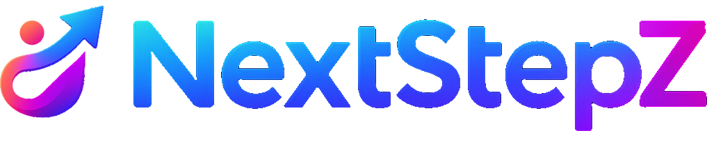

<p align="center">
  
</p>

<p align="center">
  <strong>Your First Step to the Future</strong>
</p>

<p align="center">
  
  
  
  
</p>

---

## 📖 Overview
**NextStepZ** is a full-featured **Android mobile application** developed as a  
**Second-Year Academic Project** at the  
**Vietnam–Korea University of Information Technology (VKU)**.

This project extends the original NextStepZ web application into a native Android experience,  
demonstrating the practical application of modern mobile development technologies,  
clean MVVM architecture, and professional software engineering practices  
to build a secure, performant, and maintainable platform.

---

## 🎯 Project Goals
- Migrate the NextStepZ web platform to a native Android application
- Apply MVVM architecture with clean separation of concerns
- Build a modern, premium UI using Jetpack Compose and Material Design 3
- Implement secure authentication with JWT tokens
- Integrate with the existing NestJS backend via RESTful APIs
- Demonstrate professional mobile development workflows and best practices

---

## 👥 Authors
| | Member 1 | Member 2 |
|--|--|--|
| **Name** | Nguyễn Ngọc Thái | Đoàn Văn Nguyên |
| **Major** | Information Technology (Engineer) | Information Technology (Engineer) |
| **University** | Vietnam–Korea University of Information Technology (VKU) | Vietnam–Korea University of Information Technology (VKU) |
| **Academic Level** | Second-Year Student | Second-Year Student |

---

## 🧰 Technology Stack

### 📱 Android App (Frontend)
- **Language:** Kotlin
- **UI Framework:** Jetpack Compose
- **Design System:** Material Design 3
- **Architecture:** MVVM (Model–View–ViewModel)
- **Networking:** Retrofit 2 + OkHttp
- **Serialization:** Gson
- **Navigation:** Navigation Compose
- **Local Storage:** DataStore Preferences
- **Image Loading:** Coil
- **Async:** Kotlin Coroutines + StateFlow

### ⚙️ Backend (Existing)
- **Framework:** NestJS
- **Database:** PostgreSQL
- **ORM:** Prisma
- **Authentication:** JWT + bcrypt

### 🐳 Infrastructure
- **Containerization:** Docker (Backend)
- **API Communication:** RESTful (JSON)

---

## ✨ Key Features
- Premium dark-themed UI with glassmorphism design
- Custom typography system (Poppins + Exo 2 fonts)
- Animated gradient backgrounds and micro-interactions
- Secure user authentication (Login / Register / Forgot Password)
- Token-based session management via DataStore
- Integration with NestJS backend REST APIs
- Reusable Compose component library
- MVVM architecture with Repository pattern
- Edge-to-edge display support

---

## 📂 Project Structure
```
NextStepZ/app/src/main/java/com/example/nextstepz/
├── MainActivity.kt                  ← Entry point
├── NextStepZApplication.kt          ← Application class
├── data/                            ← Data Layer
│   ├── remote/                      ← Retrofit API clients
│   ├── local/                       ← DataStore (token storage)
│   └── repository/                  ← Repository pattern
├── domain/                          ← Domain Layer
│   └── model/                       ← Business models
├── ui/                              ← Presentation Layer
│   ├── theme/                       ← Color, Typography, Theme
│   ├── components/                  ← Reusable composables
│   ├── navigation/                  ← Navigation graph
│   └── screens/                     ← Feature screens
└── util/                            ← Constants & utilities
```

---

## 🧪 Development Practices
- MVVM architecture with clean layer separation
- Reactive state management with StateFlow
- Consistent brand design system across all screens
- Environment-based API configuration
- Modular and reusable component design
- Version control with meaningful commit history

---

## ⚠️ Academic Integrity Statement
This repository is published **exclusively for academic evaluation and learning purposes**.

🚫 **Strictly prohibited actions:**
- Copying or reusing this project for coursework or academic submissions
- Submitting this project as original work by any individual or group
- Redistributing or modifying the source code without explicit permission

Any violation may be handled in accordance with the academic regulations of  
**Vietnam–Korea University of Information Technology (VKU)**.

---

## 📄 License
This project is protected under an **All Rights Reserved License**.

Please refer to the [LICENSE](./LICENSE) file for detailed terms and usage restrictions.

---

## 🚀 Vision
> **NextStepZ is designed to help users take their first confident step toward the future through technology.**
